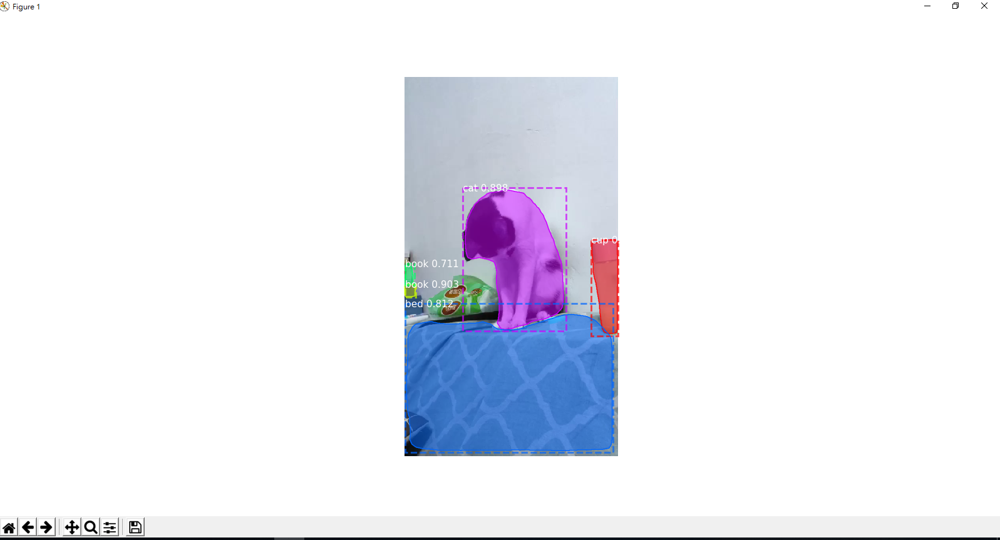

Find dang dang
=============
Find dang dang(噹噹) by Mask-R-CNN detection.

Pre Installation
---------
1. [Mask R-CNN](https://github.com/matterport/Mask_RCNN#installation)

Demo
-------
Draw the box in dang dang by Mask-R-CNN detection.

